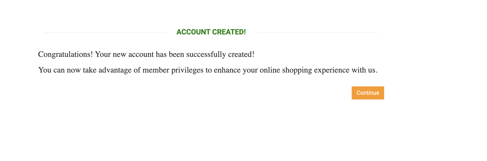

# BUG-001: Registration accepts password with 1 character — no minimum length validation

**Severity:** Critical  
**Priority:** High  
**Status:** Open  
**Environment:** Chrome / macOS  
**Found in:** https://automationexercise.com

## Steps to reproduce
1. Open https://automationexercise.com/login
2. In "New User Signup" enter name: TestUser08
3. Enter email: testuser08@test.com
4. Click "Signup"
5. On account info form enter password: a (1 character only)
6. Fill all other required fields with valid data
7. Click "Create Account"

## Expected result
System rejects the password and shows error message
about minimum password length requirement.

## Actual result
Account is created successfully with 1-character password "a".
No validation error displayed. User is logged in.

## Attachments

